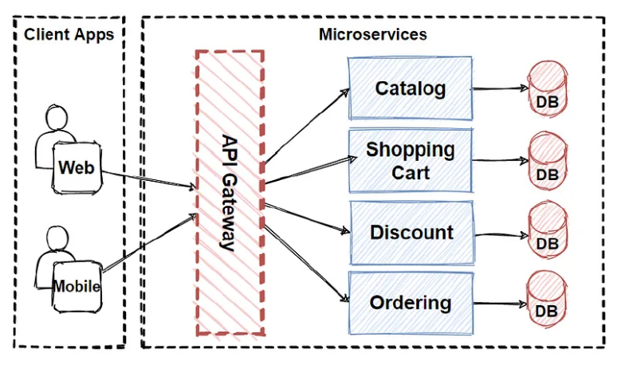

An API Gateway is like a front door for all the services of an application.

When users or other apps want to interact with your system, they don’t call each service directly — instead, everything goes through the API Gateway.
The gateway then decides where to send the request, handles security, and returns the response.

🧠 Simple Definition

An API Gateway is a single entry point that receives all API calls and forwards them to the correct backend service.

🏠 Example (Real-life Analogy)

Imagine a hotel:

Guests come to the front desk (API Gateway) for any request.

The receptionist decides which department to contact:

Room service

Housekeeping

Maintenance

Food delivery

Guests don’t go directly to these departments — they always go through the front desk.

💻 Technical Example
Scenario:

You have an online store with separate services:

User Service – handles login/signup

Product Service – shows items

Order Service – places orders

Payment Service – processes payments

Without an API Gateway:
→ The frontend must call each service directly (messy, insecure).

With an API Gateway:
→ All requests go to one URL like:

https://myshop.com/api/

The gateway routes:

/login → User Service

/products → Product Service

/order → Order Service

/pay → Payment Service

It can also:
✔ Check authentication
✔ Apply rate limits (prevent abuse)
✔ Cache responses
✔ Transform requests/responses

🧩 Example Flow

User wants to buy a product:

Frontend sends request to API Gateway:
/order/create

Gateway verifies token of the user.

Gateway forwards the request to Order Service.

Order Service sends data back through the gateway.

Gateway returns final response to the user.

📌 Why API Gateways are useful

Security in one place

Simplifies frontend

Handles load balancing

Prevents direct access to microservices

Supports logging, caching, monitoring

