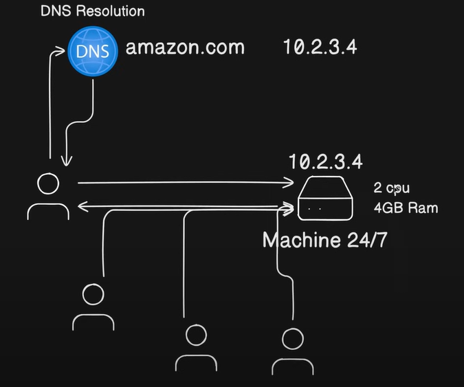
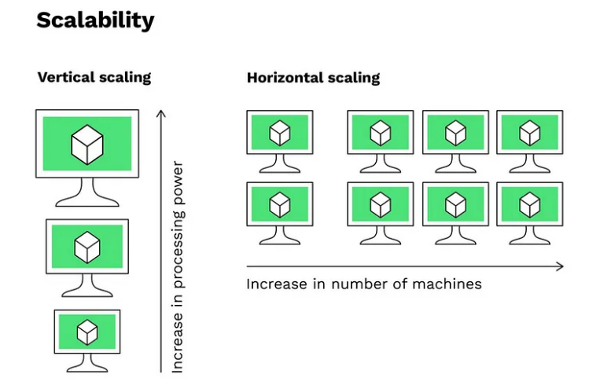

🌐 DNS Resolution

🧐 What is it? (In Simple Terms)
Imagine you want to call your friend "Alice," but you don't have her phone number memorized. You only know her name.

You look up "Alice" in the Contacts App on your phone.

The app tells you her number is 555-0199.

You press dial.

DNS (Domain Name System) Resolution is exactly this process for the internet.

You are the Browser (Chrome/Safari).

"Alice" is the Domain Name (e.g., google.com).
  
The Contacts App is the DNS Server.

The Phone Number is the IP Address (e.g., 142.250.190.46).

Core Concept: Computers don't understand words like google.com; they only understand numbers (IP addresses). DNS Resolution translates the human-readable name into the machine-readable number.

⚖️ Horizontal vs. Vertical Scaling
When designing a system to handle increased traffic or data, architects must choose a scaling strategy. The two primary methods are Vertical Scaling (scaling up) and Horizontal Scaling (scaling out).

⏫ Vertical Scaling (Scale Up)
🧐 What is it? (In Simple Terms)
Imagine your computer is getting slow. You don't buy a whole new computer; you buy a bigger, better graphics card, more RAM, and a faster CPU and install them into your existing machine.

The Computer is the Server.

The Upgrades are the Resources (CPU, RAM, Disk).

Core Concept: Vertical scaling involves increasing the resources of a single machine to handle a larger load. You make the server bigger and more powerful.

⚙️ Technical Explanation
Direction: Scaling Up.

Action: Replacing or upgrading components within one server (e.g., upgrading from a server with 8GB RAM to one with 64GB RAM).

Architecture: Often used with traditional Monolithic applications or single-node databases like MySQL or PostgreSQL, where data consistency is easier to manage on one host.

➡️ Horizontal Scaling (Scale Out)
🧐 What is it? (In Simple Terms)
Imagine your small bakery is overwhelmed with orders. Instead of trying to buy one huge, industrial oven that costs a fortune, you buy five smaller, cheaper standard ovens and hire more staff to run them.

The Five Ovens are the Multiple Servers (Nodes).

The Staff Member who directs customers to the first available oven is the Load Balancer.

Core Concept: Horizontal scaling involves adding more machines (nodes) to a pool of resources to distribute the load. You add more small servers instead of making one big server.

⚙️ Technical Explanation
Direction: Scaling Out.

Action: Adding new, often commodity, servers to the existing architecture. These servers typically sit behind a Load Balancer, which distributes incoming traffic evenly across the pool.

🏆 Why Horizontal Scaling is Best (The Modern Standard)
While vertical scaling is simpler and cheaper for small, initial growth, horizontal scaling is the undisputed foundation for building highly available and massively scalable systems in cloud-native environments.

**Biggest issue with vertical scaling is downtime. when we need to add any new resource it will restart**

